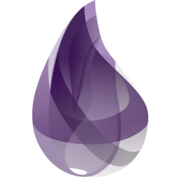

# Немного истории

Эликсир молодой язык, он создан в 2012 году. Но начать я хочу за 100 лет до этого. 

## Предыстория: начало ХХ века.

В начале ХХ века в Дании, в Копенгагенской телефонной компании работал инженер [Агнер Краруп Эрланг](https://ru.wikipedia.org/wiki/%D0%AD%D1%80%D0%BB%D0%B0%D0%BD%D0%B3,_%D0%90%D0%B3%D0%BD%D0%B5%D1%80_%D0%9A%D1%80%D0%B0%D1%80%D1%83%D0%BF)

Его интересовало, как наиболее эффективным образом использовать оборудование телефонной станции, чтобы обслуживать максимальное количество абонентов.

Агнер Эрланг был хорошо образован, с отличием закончил университет, и умел применять в работе методы математики и статистики. И он не ленился самостоятельно залезать на телефонные столбы, чтобы собрать нужные данные.

Результатом его усилий стала научная работа ["Теория массового обслуживания"](https://ru.wikipedia.org/wiki/%D0%A2%D0%B5%D0%BE%D1%80%D0%B8%D1%8F_%D0%BC%D0%B0%D1%81%D1%81%D0%BE%D0%B2%D0%BE%D0%B3%D0%BE_%D0%BE%D0%B1%D1%81%D0%BB%D1%83%D0%B6%D0%B8%D0%B2%D0%B0%D0%BD%D0%B8%D1%8F). Она позволяет рационально расчитать ресурсы, необходимые для обслуживания требований, поступающих в систему, исходя из длительности ожидания и длины очередей.

Теория применяется не только в телекоммуникационных системах, а гораздо шире: в управлении автомобильным и воздушным движением, на конвейерном производстве, в логистике, а также при проектировании фабрик, складов, магазинов и больниц.

В честь Агнера Эрланга названы единица измерения трафика в телекоммуникационных системах и язык программирования.

## История Эрланг: c 1985 по настоящее время.

Язык [Эрланг](https://www.erlang.org/) родился в недрах шведской компании Эрикссон (Ericsson) -- крупного поставщика телекомуникационного оборудования и услуг.

Для этой индустрии характерны сложное оборудование, сложный софт, большой траффик и жесткие требования по доступности сервиса.

В компании был отдел, занимающийся научной работой: Ericsson’s Computer Science Laboratory. Отделу была поставлена задача найти более эффективные средства разработки софта для железа и сервисов компании.

У компании уже был опыт разработки языков программирования. Использовались собственные проприетарные языки PLEX и EriPascal. Но они не стремились разработать еще один язык, а хотели найти подходящее решение среди уже существующих.

В течение 2х лет отдел писал прототипы телеком-приложений на разных языках, имеющихся в то время:
- функциональные языки ML и Miranda;
- многопоточные языки ADA, Modula и Chill;
- логический язык Prolog;
- объектно-ориентированный Smalltalk.

Разработчики пришли к выводу, что ни один язык не имеет нужных возможностей. И главная проблема была в реализации многопоточности на нужном уровне. В итоге лаборатория решила разработать свой язык программирования.

В отличие от большинства языков, разработанных для "общего" применения и на "правильном" теоретическом базисе, Эрланг изначально разрабатывался для узкого применения, исходя из практических требований. От этого идут его преимущества и недостатки.

В 1998 Эрланг был выпущен в open source, и стал известен за пределами Эрикссон. Следующие несколько лет он использовался в Эрикссон, и отдельными энтузиастами за пределами компании, но был мало известен.

В 2002 году был начат проект [ejabberd](https://www.ejabberd.im) -- первый крупный open source проект на Эрланг. Он стал основой для большинства IM (Instant Messaging) систем, в т.ч. для широко известного [WhatsApp](https://en.wikipedia.org/wiki/WhatsApp).

В 2006 году в появилась поддержка [симметричной мультипроцессорности (SMP)](https://en.wikipedia.org/wiki/Symmetric_multiprocessing). Эрланг научился эффективно использовать все имеющиеся в системе процессорные ядра.

И это случилось в подходящий момент. К этому времени производители процессоров достигли предела тактовых частот. Дальше наращивать мощность одного процессора было невозможно, и производители пошли по пути увеличения числа процессоров.

А у IT-индустрии появилась потребность разрабатывать многопоточные программы, эффективно использующие несколько процессоров. Делать это на популярных языках программирования было трудно, и возник интерес к функциональному программированию вообще, и к Эрланг в частности.

Этот интерес проявился в двух направлениях:
- стали шире использоваться ФП языки;
- популярные языки начали заимствовать идеи ФП и реализовывать их у себя.

В 2007 вышла книга Джо Армстронга "Programming Erlang".

Нынче Эрланг известен и применяется достаточно широко.

## История Эликсир: c 2012 по настоящее время.

[Эликсир](https://elixir-lang.org/) создан в 2012 году как исследовательский проект в компании Plataformatec. Его автор -- Жозе Валим, был одним из основных разработчиков фреймворка Ruby on Rails и сооснователем компании Plataformatec.

Авторы языка имели большой опыт веб-разработки на разных языках и с разными фреймворками. Как это обычно бывает, они постарались собрать в одном языке все лучшее из своего опыта.

Эликсир позаимствовал идеи из Ruby, Clojure и Эрланг. Большое влияние оказали Ruby и фрейморк Ruby on Rails. Система макросов заимствована из Clojure. Ну и, конечно, Эликсир унаследовал все возможности Эрланг и его виртуальной машины.

Первая версия языка вышла в 2014 году. В этом же году вышла и первая версия фреймворка Phoenix. С тех пор язык и фреймворк активно развиваются. Вокруг них сформировалось большое сообщество.
