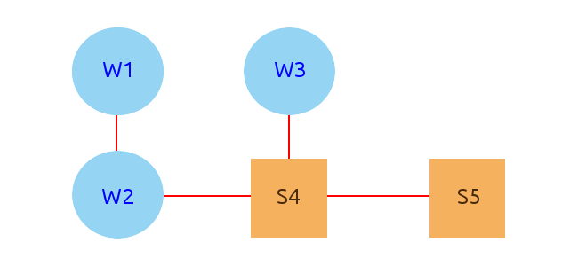
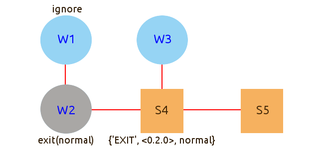
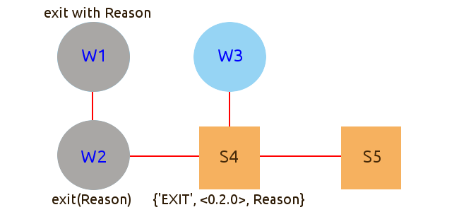
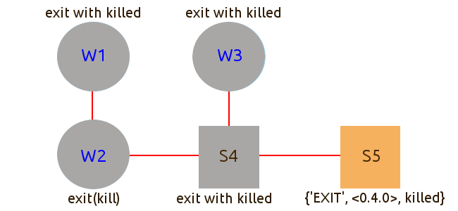

# Связь между процессами (link)

Одна из главных фич BEAM -- устойчивость к ошибкам (fault tolerance). Считается, что BEAM может легко переживать ошибки в коде и в данных, аппаратные сбои, сбои в сети, и продолжать обслуживать клиентов.

Это не значит, что любой код на Эликсир "из коробки" обладает такими свойствами.  Об этом должен позаботиться программист. BEAM только дает средства, которыми программист может обеспечить устойчивость. Давайте посмотрим, что это за средства.

Устойчивость к ошибкам построена на способности процессов наблюдать друг за другом. Для этого есть два способа -- **связь (link)** и **мониторинг (monitor)**.

Два процесса можно связать друг с другом так, что при падении одного, второй получит специальное сообщение и тоже упадет. Можно связать группу процессов, так, что при падении одного из них, упадет вся группа. 

Предполагается, что процессы зависят друг от друга в своей работе. Отсутствие одного процесса приводит к нештатной ситуации, в которой остальные не могут выполнять полезных действий. Они только усугубляют и распространяют проблемы. Так что лучше остановить и рестартовать всю группу.

Информация о падении передается специальным **системным сообщением** (**сигналом**). Системные сообщения не попадают в почтовый ящик и их нельзя обработать обычным способом. Вместо этого, они завершают процесс, который их получил, и распространяются дальше по имеющимся связям.

TODO stopped here

Вызов **link(Pid)** создает связь между текущим процессом и Pid. Связь двухсторонняя. Чтобы связать несколько процессов, нужно сделать несколько вызовов **link**. Если процессы уже связаны, то вызов **link** не оказывает никакого эффекта.

Вызов **unlink(Pid)** разрывает связь.

Часто бывает нужно создать новый процесс и связь с ним. Это можно сделать последовательными вызовами **spawn** и **link**. Но процесс может завершиться до вызова **link**. Поэтому лучше использовать функцию **spawn_link**, которая объединяет эти две операции, но выполняется атомарно.


Рассмотрим пример кода:
``` TODO elixir
-module(sample1).

-export([run/0, run_and_crash/0, work/1, work_and_crash_one/1]).

run() ->
    [spawn_link(?MODULE, work, [Id]) || Id <- lists:seq(0, 5)],
    ok.

work(Id) ->
    io:format("~p ~p started~n", [Id, self()]),
    timer:sleep(1000),
    io:format("~p ~p stopped~n", [Id, self()]),
    ok.
```

Здесь мы запускаем 5 процессов, и связываем их все с процессом консоли. Они стартуют, ждут 1 секунду, и завершаются:

``` TODO elixir
2> sample1:run().
0 <0.40.0> started
1 <0.41.0> started
2 <0.42.0> started
3 <0.43.0> started
4 <0.44.0> started
5 <0.45.0> started
ok
5 <0.45.0> stopped
4 <0.44.0> stopped
3 <0.43.0> stopped
2 <0.42.0> stopped
1 <0.41.0> stopped
0 <0.40.0> stopped
```

Теперь сделаем, чтобы один из процессов завершался. Это будет 3-й процесс, как раз в середине всей группы процессов:

``` TODO elixir
run_and_crash() ->
    [spawn_link(?MODULE, work_and_crash_one, [Id]) || Id <- lists:seq(0, 5)],
    ok.

work_and_crash_one(Id) ->
    io:format("~p ~p started~n", [Id, self()]),
    if
        Id == 3 ->
            io:format("~p ~p exiting~n", [Id, self()]),
            exit(for_some_reason);
        true -> ok
    end,
    timer:sleep(1000),
    io:format("~p ~p stopped~n", [Id, self()]),
    ok.
```

Видим, что стартуют все процессы, но ни один из них не выполняется до конца, потому что вместе с 3-м процессы завершились и все остальные.

``` TODO elixir
7> self().
<0.68.0>
8> sample1:run_and_crash().
0 <0.71.0> started
1 <0.72.0> started
2 <0.73.0> started
3 <0.74.0> started
4 <0.75.0> started
5 <0.76.0> started
3 <0.74.0> exiting
ok
** exception exit: for_some_reason
9> self().
<0.77.0>
```

Процесс консоли также завершился, и рестартовал заново.


## Системные процессы

Связи -- это хорошо, но этого мало. Наш следующий инструмент -- разделение ролей между процессами.  Есть рабочие процессы, которые делают полезную работу.  И есть системные процессы, которые следят за состоянием рабочих процессов.

Чтобы сделать процесс системным, достаточно вызывать:
``` TODO elixir
process_flag(trap_exit, true)
```

При этом для процесс устанавливается специальный флаг **trap_exit**. После чего сигналы, которые они получает, превращаются в обычные сообщения и попадают в почтовый ящик.  Таким образом системный процесс может обработать падение рабочего процесса.

Сигнал превращается в сообщение вида:
``` TODO elixir
{'EXIT', Pid, Reason}
```

Это кортеж из 3-х элементов. На первой позиции атом 'EXIT', на второй -- Pid рабочего процесса, на третей позиции -- причина завершения процесса (обычно атом или исключение).


Рассмотрим пример:
``` TODO elixir
-module(sample2).

-export([run/0, system_process/0, worker/0]).

run() ->
    spawn(fun system_process/0),
    ok.


system_process() ->
    io:format("~p system process started~n", [self()]),
    process_flag(trap_exit, true),
    spawn_link(fun worker/0),
    receive
        Msg -> io:format("~p system process got message ~p~n", [self(), Msg])
    after 2000 -> ok
    end,
    ok.


worker() ->
    io:format("~p worker started~n", [self()]),
    timer:sleep(500),
    exit(some_reason),
    ok.
```

Здесь сперва создается системный процесс, затем связанный с ним рабочий процесс. Рабочий процесс завершается после небольшой паузы, а системный процесс получает сообщение об этом.

``` TODO elixir
2> sample2:run().
<0.40.0> system process started
<0.41.0> worker started
ok
<0.40.0> system process got message {'EXIT',<0.41.0>,some_reason}
```


## Варианты событий при завершении процесса

Процесс может завершится двумя способами: нормально или аварийно. В первом случае процесс просто выполнил до конца ту функцию, с которой он стартовал. Во втором случае произошла какая-то ошибка или исключение.

Кроме этого, процесс можно принудительно завершить вызовом функции **exit**.

**exit/1** завершает текущий процесс с заданной причиной:
``` TODO elixir
exit(normal)
exit(some_reason)
```

**exit/2** завершает процесс с заданным Pid:
``` TODO elixir
exit(Pid, normal)
exit(Pid, some_reason)
```

Таким образом можно эмулировать и нормальное и аварийное завершение процесса.

Возьмем систему из 5 связанных процессов:



Здесь три рабочих процесса: W1, W2, W3, и два системных процесса: S4, S5. Красными линиями показаны связи.

Рассмотрим, что будет происходить в системе при завершении процесса W2 с разными причинами.


### Нормальное завершение процесса



Процесс W2 завершается нормально. Сигнал доходит до процесса W1, но игнорируется. W1 продолжает работать, хотя теперь он ни с кем не связан.

Сигнал доходит до процесса S4, превращается в сообщение {'EXIT', <0.2.0>, normal}, и попадает в почтовый ящик S4. Дальше сигнал не распространяется.


### Аварийное завершение процесса



Процесс W2 завершается аварийно с некой причиной **Reason**. Сигнал доходит до процесса W1, и W1 тоже завершается аварийно с той же причиной.

Сигнал доходит до процесса S4, превращается в сообщение {'EXIT', <0.2.0>, Reason}, и попадает в почтовый ящик S4. Дальше сигнал не распространяется.


### Завершение процесса с причиной kill

Пока все просто. Но создатели эрланг предусмотрели способ аварийно завершить системный процесс на случай, если большая часть системы придет в неконсистентное состояние. Этот способ -- завершение процесса с причиной **kill**.

Сигнал с причиной **kill** не превращается в сообщение, не перехватывается системным процессом, а заставляет процесс завершиться с причиной **killed**. Тут важно, что меняется причина с **kill** на **killed**, иначе такой сигнал невозможно было бы остановить, и он завершил бы все процессы. Ну а **killed** перехватывается системными процессами обычным способом.



Процесс W2 завершается с причиной **kill**. Сигнал доходит до процесса W1, и W1 завершается с причиной **killed**.  Сигнал доходит до процесса S4, и S4 завершается с причиной **killed**.

Сигнал распространяется дальше. Доходит до W3, и W3 завершается с причиной **killed**.  Наконец, сигнал доходит до S5, превращается в сообщение {'EXIT', <0.4.0>, killed}, и попадает в почтовый ящик S5.


------------------------------------------------

Kernel.spawn_link/1 and Kernel.spawn_link/3
Kernel.spawn_monitor/1 and Kernel.spawn_monitor/3

Process.monitor demonitor
link unlink

A basic primitive for detecting a process crash is the concept of links.

When processes are linked, each can receive information when the other exits (exit signal).

Exit signal contains:
- the pid of the crashed process;
- exit reason (arbitrary term).

In case of normal termination the exit reason is the atom :normal.
If exit reason is anything other than :normal, the linked process is also taken down. 

So our child process died, and it killed the entire application. 
That’s the default behavior of linked processes — when one exits abnormally, it kills the other.

However, you can tell Elixir to convert the exit signals from a linked process into a message you can handle. 
Do this by trapping the exit.

If a process is trapping exits, it isn't taken down. Instead, an exit signal is turned into usual message and is placed into message queue. A trapping process can receive these messages and do something about the crash.

```
Process.flag(:trap_exit, true)
{:EXIT, from_pid, exit_reason}
```


